<u>**Introduction** </u>

The Common Source (CS) configuration is a type of MOSFET configuration
that is widely used as a voltage or power amplifier. The input ac small
signal is supplied to the gate (G) terminal, which has a high input
resistance, so as to not disturb the dc Q-point (quiescent operating
point) that the circuit has been biased with to produce necessary
amplification. The output is taken across the drain (D) terminal. The CS
amplifier is a transconductance amplifier, i.e., if we supply voltage
(V) as an input, we will obtain a current (I) as the output.

In this experiment, we have simulated a CS amplifier configuration,
without a source resistance Rₛ , and performed various analysis using
the LTSpice tool, a popular tool for designing, analysing a circuit’s
performance. We have made use of the TSMC 180 nm SPICE library (.lib)
file to set the parameters of our N-channel MOSFET (NMOS).

For this particular circuit, we have been given a power budget of 50 μW,
given the supply voltage of 1.8V, drain resistance (RD) =
1kΩ.

**<u>Circuit and Components Required</u>**

The circuit is wired up as follows.   
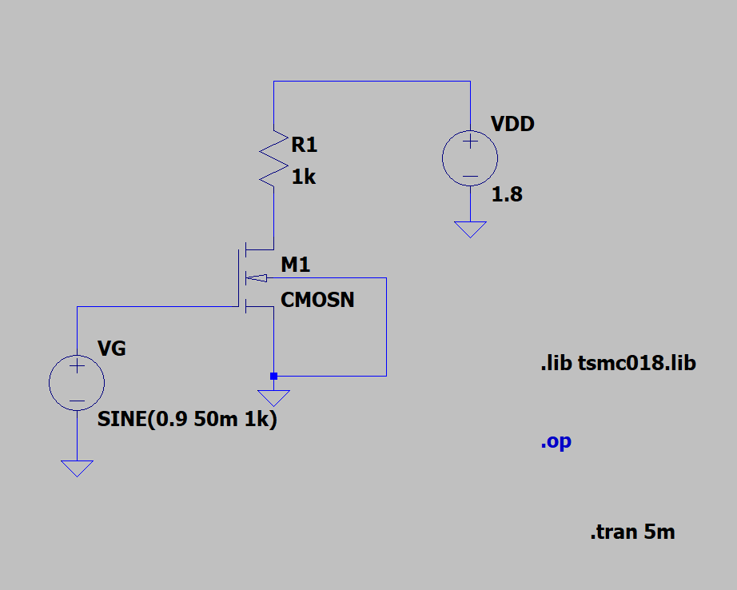

The components we require are

1.  N-channel Enhancement MOSFET (CMOSN)

2.  DC Supply Voltage - 1.8V (VDD)

3.  Resistor - 1kΩ

4.  Power Supply - 0.9V DC, 50mV sinusoidal signal (VG)

The MOSFET we use has a width (W) = 1.12 µm, length (L) = 180 nm.

**<u>Procedure</u>**

1.  To start, we need to wire the circuit, and measure the DC Q-point,
    according to the requirements we have been given.

2.  Open the LTSpice simulation tool, and click on the IC symbol, which
    will open a dropdown menu of the list of components available. From
    the list, select **“nmos4”**, which is a 4 terminal NMOS, i.e., gate
    (G), drain (D), source (S), body (B). Since we neglect body effect
    for this circuit, the body terminal must be connected to the lowest
    potential, i.e., ground.

3.  After placing the NMOS, place the rest of the required components,
    assemble the circuit as per the given circuit diagram.

4.  Next, click the .t icon on the toolbar. This lets you add a SPICE
    directive, which will allow you to specify the process technology
    and the parameters for the MOSFET. In this case, we will be using
    the **TSMC 180 nm process technology**.

5.  Before giving the SPICE directive, make sure to save the TSMC 180 nm
    SPICE netlist, or .lib file in the folder where you have saved
    LTSpice on your system.

6.  Next, using the .t tool, give the directive, **.lib tsmc018.lib**,
    and click ‘OK’. Then place this command anywhere in the schematic.

7.  After this, we can perform various analyses - DC, AC, transient, DC
    operating point, etc. The results of these will be discussed further
    in the report.

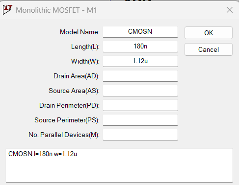

> **Parameters of N-channel MOSFET, M1.**

**<u>DC Operating Point</u>**

Using the LTSpice tool, we can determine the DC operating
(VDS, ID) point of our MOSFET, based on our input
MOSFET parameters and given requirements.

Given that power budget = 50 𝜇W, we use P = VDD.
ID, to calculate ID, given that supply voltage
VDD = 1.8V.

50 𝜇W = (1.8) x ID, which gives us **ID = 27.778
𝜇A**.

Now that we have the value of ID, we can calculate
VD.

Applying KVL in the drain portion of the circuit - 

VD = VDD - IDRD — (1)

Substituting the values, we get - 

VD = 1. 8- (27.775𝜇A x 1kΩ) = **1.7722V**

Now, we can check whether the MOSFET is in the saturation region, and
ensure that it provides ideal amplification.

We know for saturation, VGD \< Vt.

**Vt = 0.3662 V** (From tsmc018.lib file)

VGD = 0.9 - 1.7722 = **-0.8722 V**

∴ Since VGD \< Vt, we can say that the MOSFET is
operating in the saturation region.

∴ The operating point of this MOSFET is – (1.7722 V, 27.778 𝜇A), with
VGS = 0.9 V.

To perform this analysis, we go to the Run icon on the LTSpice toolbar,
or use the Alt + R shortcut. After that, click on the DC operating point
tab. Then click ‘OK’, and place the .op file anywhere on the schematic.

This will open a window of all the node voltages, branch currents and
resistances in your schematic.

**<u>Results</u>**

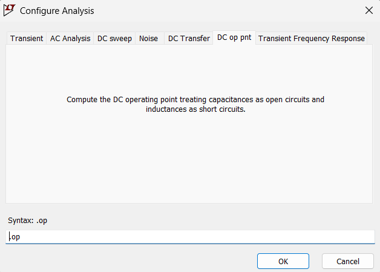

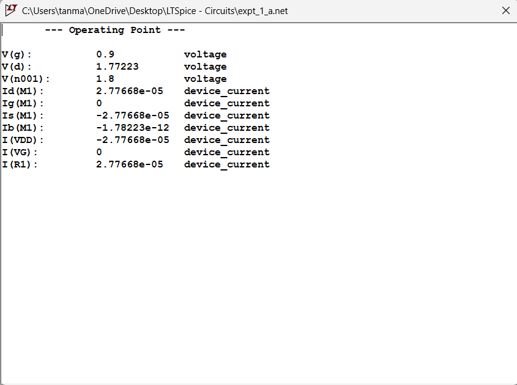

From this, we can see VD = **1.77223V,** ID **=
27.77668 𝜇A**. These closely match our calculated values.

Now, using the saturation drain current equation, we can vary parameters
like W, L and see how the drain current value and drain-to-source
voltage will change.

The MOSFET drain current equation in saturation is given by -
$`i_{D} = \frac{1}{2}k_{n}v_{ov}^{2}`$

Where, kₙ = µₙCₒₓ(W/L), is the MOSFET transconductance parameter,

VOV = VGS - Vt is known as the
overdrive voltage.

As we can see from the drain current eqn., iD is directly
proportional to W, and inversely proportional to L. So, by changing the
value of W, L, we can verify the dependency of drain current on these
parameters.

**<u>Transient Analysis</u>**

The next analysis we will perform is transient analysis. Using LTSpice,
we can plot the output voltage (VD) against time in seconds.
This will be an ac analysis, since the voltage will vary over time, so
we need to supply an ac input signal.

To apply an ac input, we can right click the gate voltage source,
VG, which will open a pop-up window. Click on the “Advanced”
option, and then navigate to the SINE option. This lets you set the
input as a sine wave. Next, we will set the parameters.

Set DC offset = 0.9 V (this ensures that DC Q-point is not disturbed),
Amplitude (V) = 50 mV (this will ensure the small signal condition,
i.e., Vgs \<\< 2VOV is satisfied), Frequency (Hz)
= 1 kHz.

Next open the “Configure Analysis” window by clicking the Run icon, or
by pressing the “A” key. Then open the Transient Analysis tab, and then
set Stop time = 5 ms. The rest of the parameters are not required for
now. Place the **.tran 5m** command anywhere on the schematic, and run
the simulation.

**<u>Results</u>**

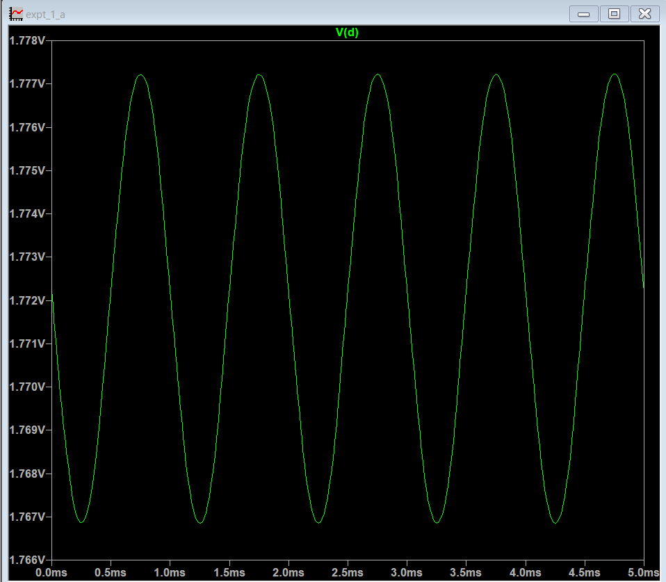

From the waveform, we can see that the peak voltage of the output signal
is around 1.777 V. We can also see that the waveform is inverted
compared to the input. This indicates a 180° phase shift, which results
in a negative gain.

Since we know the amplitude of the input voltage, Vin, and
approximated amplitude of the output voltage, Vout, we can
calculate small signal gain.

**Av = -( Vout/ Vin) = -(1.777/50m) =
-35.54**

**<u>AC Analysis</u>**

The next analysis we can perform is the AC analysis, to compute the
small signal AC behavior of the circuit, and calculate the midband and
find breaking frequencies, i.e., fL, fH.

The resultant graph gives us the Bode plot of the circuit’s behavior,
which is the variation of gain over frequency, and also the variation of
phase over frequency, in one plot.

To perform this, go to the Run icon and click on “**Configure
Analysis**”. Then choose the AC analysis tab, and input the necessary
parameters.

For our analysis, choose “Type of Sweep” = Decade, so that the plot of
gain will be dB/decade, and the number of points per decade = 20. Set
start frequency = 0.1 Hz, end frequency = 1 THz, which gives us a large
range of frequency to find results.

Place the **“.ac dec 20 0.1 1T”** directive anywhere on the schematic
and click Run.

**<u>Results</u>**

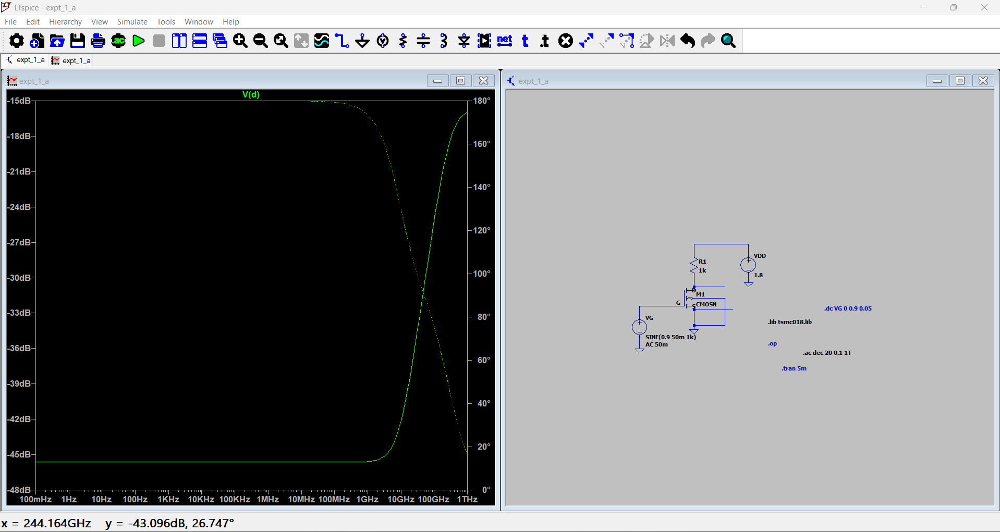

From the plot, we can see that the midband gain is around -15 dB, for an
input ac sine signal, of amplitude 50 mV. The gain is negative due to a
180° phase shift, which inverts the output compared to the input. We can
also see that the phase shift is approximately between 160° - 180°, but
closer to 180°, which explains the reason for the negative gain and the
inverted output.

Converting our gain from V/V to dB, using the formula A’V =
-10log10(Av)

A’V = -10log10(35.54) = -10(1.5507) = -15.507

∴ **A’V = -15.507**, which matches approximately with the
gain value from the Bode plot.

We can also see that the gain begins falling at around 1 GHz, which we
can assume to be the fH value.

**<u>DC Sweep</u>**

**<u>Transfer Characteristics</u>**

The next analysis we will perform is DC sweep. Using the LTSpice tool,
we can plot the transfer and drain characteristics for the MOSFET in the
circuit. By varying VGS, while keeping VDS
constant, we can plot the transfer characteristics, and vice-versa, the
drain characteristics. We can also plot the voltage transfer
characteristics (VTC), and determine if our operating point is at the
Q-point of the circuit, which will give us necessary amplification.

To perform the DC sweep on VGS, and obtain transfer
characteristics, we go to the “Configure Analysis” option and choose the
DC sweep tab, and input the parameters. For this analysis, set the name
of 1st source to sweep = VG, the type of sweep =
Linear, start value = 0V, stop value = 0.9V, which is the maximum value
of the input gate voltage, increment = 0.05V.

Place the **“.dc VG 0 0.9 0.05”** directive anywhere on the schematic,
and then click on the “Run” icon.

**<u>Results</u>**

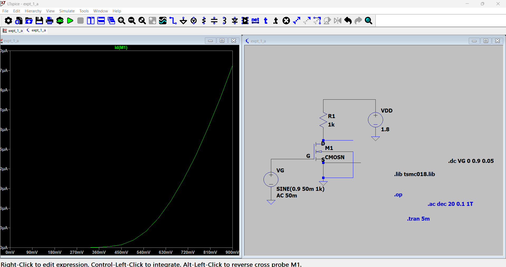

We can see the transfer characteristics of the MOSFET, i.e., the plot of
VGS versus drain current, ID.

The voltage at which the current starts flowing through the MOSFET is
around 360 mV = 0.36 V ≈ 0.3662473 V, which is the NMOS threshold
voltage (Vt) from the tsmc018.lib file.

**<u>Drain Characteristics</u>**

To perform the DC sweep on VDS, and obtain drain
characteristics, we go to the “Configure Analysis” option and choose the
DC sweep tab, and input the parameters. For this analysis, set the name
of 1st source to sweep = VDD, the type of sweep =
Linear, start value = 0V, stop value = 1.8V, which is the maximum value
of the input gate voltage, increment = 0.1V.

Place the **“.dc VDD 0 1.8 0.1”** directive anywhere on the schematic,
and then click on the “Run” icon.

**<u>Results</u>**

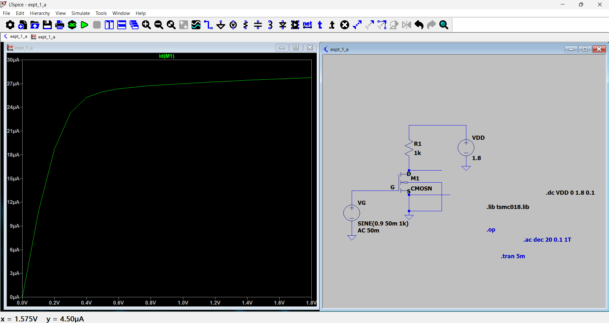

From this plot, we can see that the MOSFET is in triode from 0 V until
somewhere between 0.4V – 0.6V. At a little more than 0.6V, the MOSFET
goes into saturation, and the drain current ID, becomes a
constant. The ID value (in saturation) is around 27 µA, which
matches approximately with our calculated value of 27.778 µA.

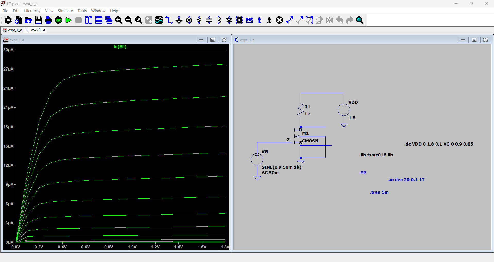

This plot shows us the drain characteristics at different values of
VGS, from 0V – 0.9V, in steps of 0.05V. To perform this
analysis, go to the DC sweep tab, and without changing the
1st source sweep parameters, i.e., VDS parameters,
click on the 2nd source to sweep tab, and set name of
2nd source to sweep = VG, type of sweep = Linear,
start value = 0 V, end value = 0.9 V, increment value = 0.05V. Then
click “Ok”, and then click on “Run”. This will return the plot.

**<u>Voltage Transfer Characteristic</u>**

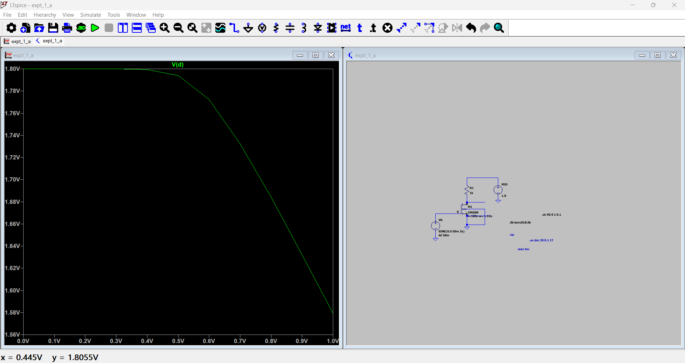

**<u>Variation of Parameters</u>**

1.  **Variation of ID with varying values of RD
    (10Ω – 1kΩ, with increments of 50Ω) –**

> We can use LTSpice to measure values of ID, while varying
> RD, and simultaneously perform DC sweep, transient
> analysis, and AC analysis. We can do this by using the SPICE directive
> or clicking the .t icon.
>
> Next right click on the resistor R1, and change the value
> of the resistor from 1kΩ to {R}. This changes the value of the
> resistor to a parameter, which can be varied between values.
>
> Then, using the SPICE directive, type **“.step param R 10 1k 50”**,
> which tells LTSpice to vary R from 10Ω to 1kΩ, in steps of 50Ω.

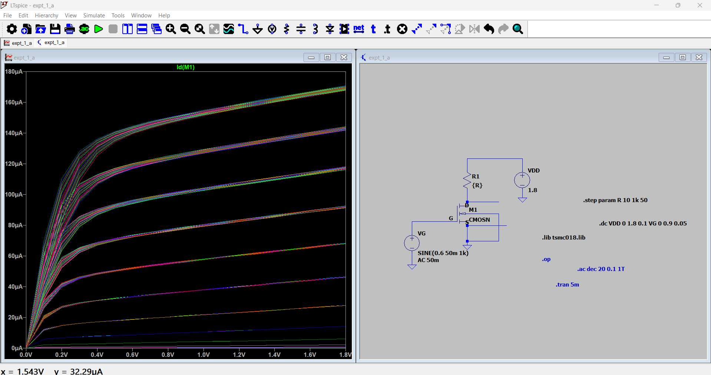

2.  **Variation of ID with varying values of W (0.5µm –
    1.5µm, with increments of 0.5µm)-**

> We can use LTSpice to measure values of ID, while varying
> W, and simultaneously perform DC sweep, transient analysis, and AC
> analysis. We can do this by using the SPICE directive or clicking the
> .t icon.
>
> Next right click on the MOSFET M1, and change the value of W from
> 1.12u to {w}. This changes the value of the width to a parameter,
> which can be varied between values.
>
> Then, using the SPICE directive, type **“.step param w 0.5u 1.5u
> 0.5u”**, which tells LTSpice to vary W from 0.5 µm to 1.5 µm in steps
> of 0.5 µm.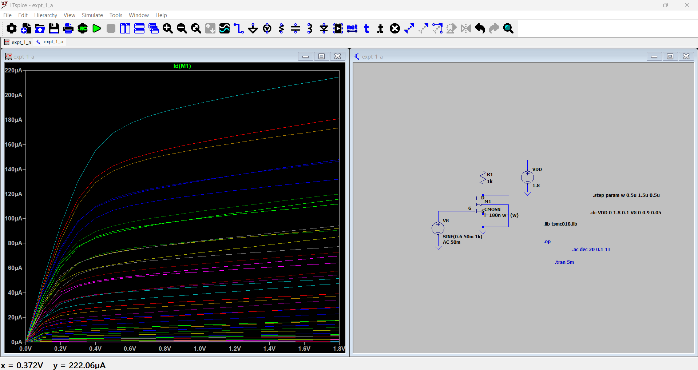 style="width:6.33611in;height:3.66944in" />

3.  **Variation of ID with varying values of L (50 nm – 200
    nm, with increments of 10 nm)-**

> We can use LTSpice to measure values of ID, while varying
> L, and simultaneously perform DC sweep, transient analysis, and AC
> analysis. We can do this by using the SPICE directive or clicking the
> .t icon.
>
> Next right-click on the MOSFET M1, and change the value of the length
> from 180 nm to {l}. This changes the value of the length to a
> parameter, which can be varied between values.
>
> Then, using the SPICE directive, type **“.step param l 50n 200n
> 25n”**, which tells LTSpice to vary L from 50 nm to 200 nm, in steps
> of 25 nm.
>
> 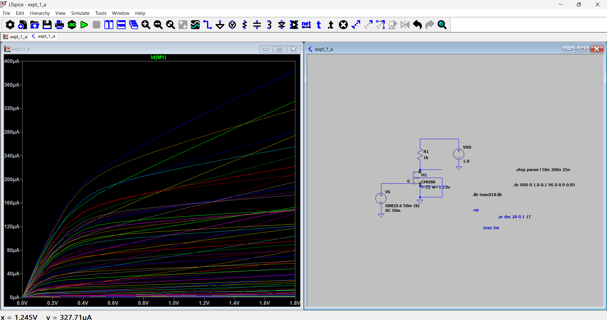

**<u>Final Results</u>**

- Drain Current, ID = 27.7668 µA

- Drain-to-source voltage, VDS = 1.7723 V

- Gain (V/V) = -35.54 V/V

- Gain (dB) = -15.507 dB

**<u>Inference</u>**

From this experiment, we understand the behavior of the MOSFET using
various analyses, such as DC analysis, transient analysis, DC sweep, AC
analysis. The results of our analysis prove that the MOSFET is a voltage
controlled current device, since changing the values of input value
VGS changes the values of output current.

We can also when we perform AC analysis, the MOSFET amplifies input
signal, from 50 mV, to 1.77 V, giving a gain of -35.54, due to a 180°
phase shift, causing output to be inverted compared to output. The AC
analysis results give us a gain of -15 dB, with a phase shift of almost
180°.

Next, we saw the variation of drain current due to W, L parameters of
the MOSFET. We also saw the variation of ID, with
R1, i.e., RD value.

Finally, we learnt how to use the LTSpice simulation tool, which
provides an easy way to simulate and test circuits, while maintaining
process parameters that would be used during fabrication, via SPICE
directives, .lib files.
