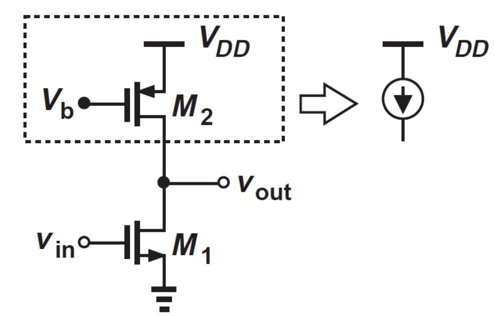
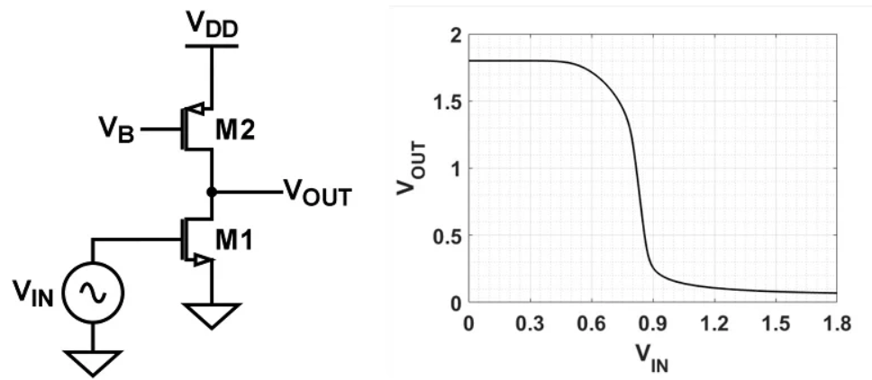
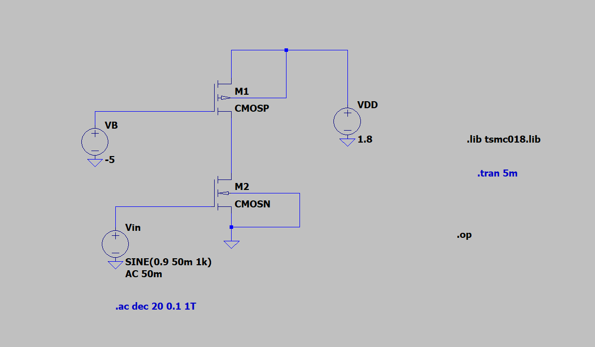
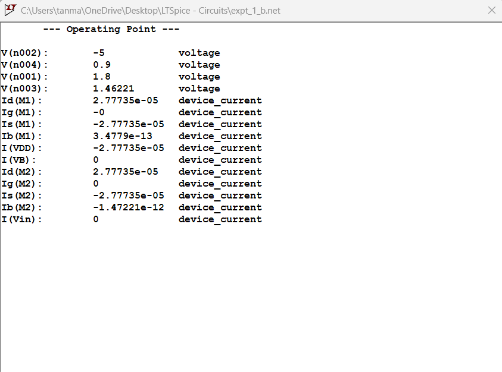
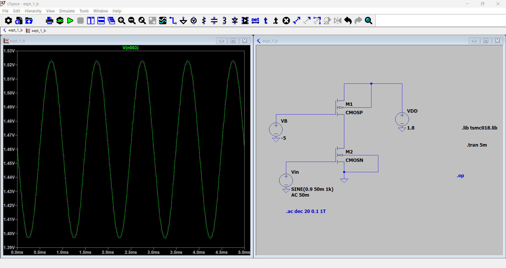
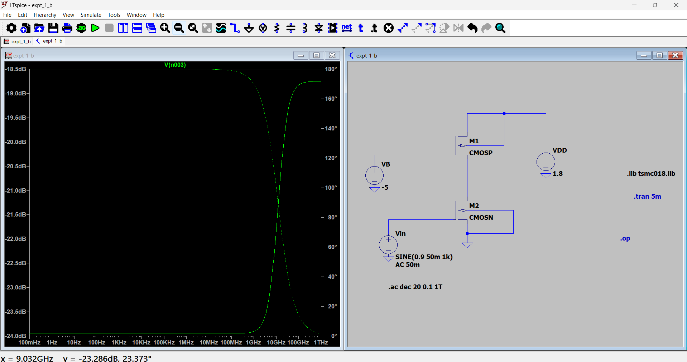
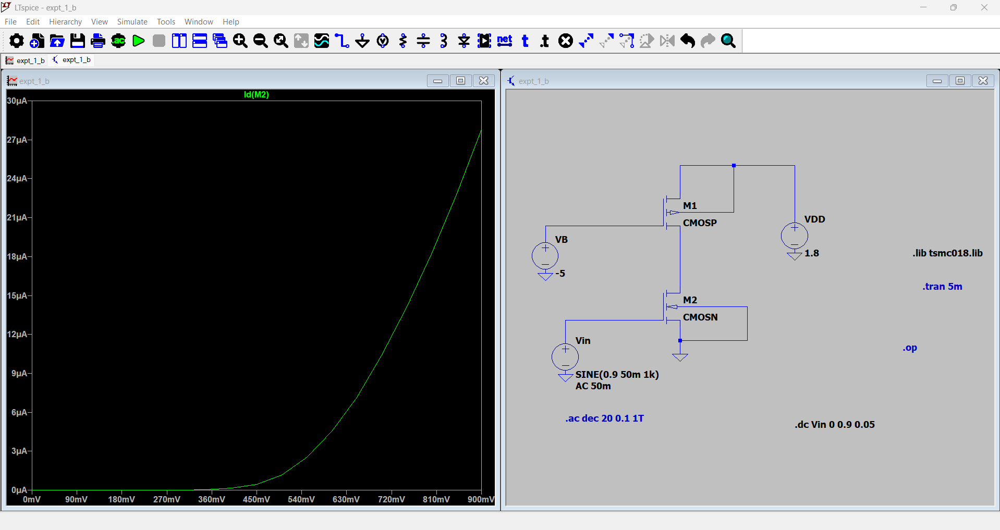
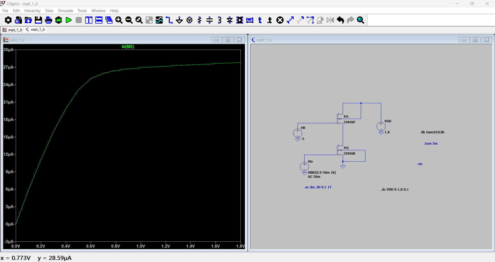
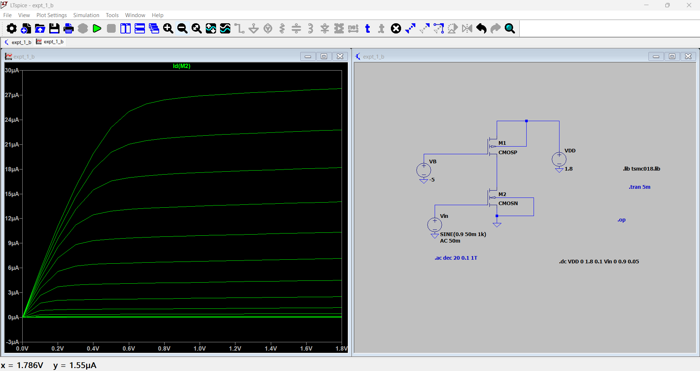
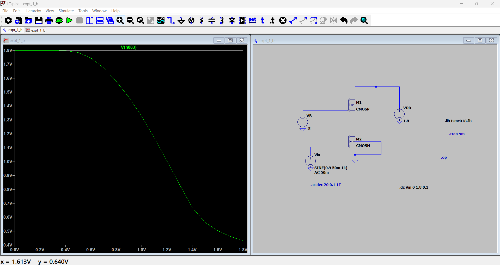

**<u>Introduction</u>**

In this experiment, we connect a P-channel enhancement MOSFET in series
with a N-channel enhancement MOSFET, and perform various analyses, such
as DC sweep, AC analysis, DC operating point, transient Analysis.

The picture above is a current source load. If we connect the PMOS in
this way, and bias into saturation, it behaves as a current source. The
current we need from this current source should be around **27.778 µA**,
which is the saturation region drain current of the NMOS. If the NMOS is
in this region, it will offer ideal amplification.

To do analysis on this circuit, we can use the LTSpice tool to input
values for our circuit, test various parameters, perform various
analyses, and verify our expectations and results.

While using LTSpice, we will use the **TSMC 180 nm process technology**
file, via the **.lib tsmc018.lib** SPICE directive.

For PMOS, using **W = 180 nm, L = 0.2 µm**, and for NMOS, **W = 700 nm,
L = 697.5 nm**, we get the current flowing through the circuit to be
**27.7735 µA**, which is close to the value we want.

**<u>Components Required</u>**

1.  N-channel Enhancement MOSFET (CMOSN)

2.  P-channel Enhancement MOSFET (CMOSP)

3.  DC Supply Voltage: - 1.8V (VDD), -5V (VB)

4.  Power Supply - 0.9V DC, 50mV sinusoidal signal (Vin)

**The NMOS we use has a width (W) = 697.5 nm, length (L) = 700 nm, while
the PMOS has width (W) = 180 nm, length (L) = 0.2 µm.** These values are
obtained through trial-and-error.

**<u>Procedure</u>**

1.  To start, we need to wire the circuit, and measure the DC Q-point,
    according to the requirements we have been given.

2.  Open the LTSpice simulation tool, and click on the IC symbol, which
    will open a dropdown menu of the list of components available. From
    the list, select **“nmos4”**, which is a 4 terminal NMOS, i.e., gate
    (G), drain (D), source (S), body (B). Since we neglect body effect
    for this circuit, the body terminal must be connected to the lowest
    potential, i.e., ground.

3.  After placing the NMOS, select the “**pmos4**” device from the
    components list, which is a 4 terminal PMOS, i.e., gate (G), drain
    (D), source (S), body (B). Since we neglect body effect for the
    PMOS, we connect the body terminal to the most positive potential,
    which in this case is VDD.

4.  Next, click the .t icon on the toolbar. This lets you add a SPICE
    directive, which will allow you to specify the process technology
    and the parameters for the MOSFET. In this case, we will be using
    the **TSMC 180 nm process technology**.

5.  Before giving the SPICE directive, make sure to save the TSMC 180 nm
    SPICE netlist, or .lib file in the folder where you have saved
    LTSpice on your system.

6.  Next, using the .t tool, give the directive, **.lib tsmc018.lib**,
    and click ‘OK’. Then place this command anywhere in the schematic.

7.  After this, we can perform various analyses - DC, AC, transient, DC
    operating point, etc. The results of these will be discussed further
    in the report.

>  style="width:6.48455in;height:3.78613in" />

**<u>DC Operating Point</u>**

Using the LTSpice tool, we can determine the DC operating
(VDS, ID) point of our MOSFET, based on our input
MOSFET parameters and given requirements.

From the DC operating point analysis, we can see that the drain current,
**ID = 27.773 µA**, **VD = 1.46221 V.**

Now, we can check whether the PMOS & NMOS are in the saturation region,
and ensure that it provides ideal amplification, and ensure that the
PMOS behaves like a current source.

We know for saturation, VGD \< Vt.

**Vtn = 0.3662 V** (From tsmc018.lib file)

VGD = 0.6 - 1.46221 = **-0.86221 V**

∴ Since VGD \< Vt, we can say that the NMOS is
operating in the saturation region.

∴ The operating point of this MOSFET is – (1.4622, 27.778 𝜇A), with
VGS = 0.9 V.

Similarly, for PMOS: -

VSD \> VSG + Vtp, **Vtp =
-0.3906012 V** (From tsmc018.lib file), which gives us: –

(1.8 + 1.46221) V \> (1.8 – 5) – 0.39 V = 3.26221 V \> -3.59 V

**Therefore, the PMOS is also in saturation.**

We can calculate the power dissipated by the NMOS, by multiplying
ID by VD,

**P = ID x VD = 27.735 µA x 1.8 V = 49.923
µW**

To perform this analysis, we go to the Run icon on the LTSpice toolbar,
or use the Alt + R shortcut. After that, click on the DC operating point
tab. Then click ‘OK’, and place the .op file anywhere on the schematic.

This will open a window of all the node voltages, branch currents and
resistances in your schematic.

**<u>Transient Analysis</u>**

The next analysis we will perform is transient analysis. Using LTSpice,
we can plot the output voltage (VD) against time in seconds.
This will be an ac analysis, since the voltage will vary over time, so
we need to supply an ac input signal.

To apply an ac input, we can right click the gate voltage source,
VG, which will open a pop-up window. Click on the “Advanced”
option, and then navigate to the SINE option. This lets you set the
input as a sine wave. Next, we will set the parameters.

Set DC offset = 0.9 V (this ensures that DC Q-point is not disturbed),
Amplitude (V) = 50 mV (this will ensure the small signal condition,
i.e., Vgs \<\< 2VOV is satisfied), Frequency (Hz)
= 1 kHz.

Next open the “Configure Analysis” window by clicking the Run icon, or
by pressing the “A” key. Then open the Transient Analysis tab, and then
set Stop time = 5 ms. The rest of the parameters are not required for
now. Place the **.tran 5m** command anywhere on the schematic, and run
the simulation.

**<u>Results</u>**

From the waveform, we can see that the peak voltage of the output signal
is around 1.5228 V. We can also see that the waveform is inverted
compared to the input. This indicates a 180° phase shift, which results
in a negative gain.

Since
we know the amplitude of the input voltage, Vin, and
approximated amplitude of the output voltage, Vout, we can
calculate small signal gain.

**Av = -( Vout/ Vin) = -(1.5228/50m) =
-30.456 V/V**

**<u>AC Analysis</u>**

The next analysis we can perform is the AC analysis, to compute the
small signal AC behavior of the circuit, and calculate the midband and
find breaking frequencies, i.e., fL, fH.

The resultant graph gives us the Bode plot of the circuit’s behavior,
which is the variation of gain over frequency, and also the variation of
phase over frequency, in one plot.

To perform this, go to the Run icon and click on “**Configure
Analysis**”. Then choose the AC analysis tab, and input the necessary
parameters.

For our analysis, choose “Type of Sweep” = Decade, so that the plot of
gain will be dB/decade, and the number of points per decade = 20. Set
start frequency = 0.1 Hz, end frequency = 1 THz, which gives us a large
range of frequency to find results.

Place the **“.ac dec 20 0.1 1T”** directive anywhere on the schematic
and click Run.

From the plot, we can see that the midband gain is around **-18.5 dB**,
for an input ac sine signal, of amplitude 50 mV. The gain is negative
due to a 180° phase shift, which inverts the output compared to the
input. We can also see that the phase shift is approximately between
160° - 180°, around 170°, which explains the reason for the negative
gain and the inverted output.

We can also see that the gain begins falling at around 1 GHz, which we
can assume to be the fH value.

**<u>DC Sweep</u>**

**<u>Transfer Characteristics</u>**

The next analysis we will perform is DC sweep. Using the LTSpice tool,
we can plot the transfer and drain characteristics for the MOSFET in the
circuit. By varying VGS, while keeping VDS
constant, we can plot the transfer characteristics, and vice-versa, the
drain characteristics. We can also plot the voltage transfer
characteristics (VTC), and determine if our operating point is at the
Q-point of the circuit, which will give us necessary amplification.

To perform the DC sweep on Vin, and obtain transfer
characteristics, we go to the “Configure Analysis” option and choose the
DC sweep tab, and input the parameters. For this analysis, set the name
of 1st source to sweep = Vin, the type of sweep =
Linear, start value = 0V, stop value = 0.9V, which is the maximum value
of the input gate voltage, increment = 0.05V.

Place the **“.dc VG 0 0.9 0.05”** directive anywhere on the schematic,
and then click on the “Run” icon.

We can see the transfer characteristics of the MOSFET, i.e., the plot of
VGS versus drain current, ID.

The voltage at which the current starts flowing through the MOSFET is
around 360 mV = 0.36 V ≈ 0.3662473 V, which is the NMOS threshold
voltage (Vt) from the tsmc018.lib file.

**<u>Drain Characteristics</u>**

To perform the DC sweep on VDS, and obtain drain
characteristics, we go to the “Configure Analysis” option and choose the
DC sweep tab, and input the parameters. For this analysis, set the name
of 1st source to sweep = VDD, the type of sweep =
Linear, start value = 0V, stop value = 1.8V, which is the maximum value
of the input gate voltage, increment = 0.1V.

Place the **“.dc VDD 0 1.8 0.1”** directive anywhere on the schematic,
and then click on the “Run” icon.

From this plot, we can see that the MOSFET is in triode from 0 V until
somewhere between 0.4V – 0.6V. At a little more than 0.6V, the MOSFET
goes into saturation, and the drain current ID, becomes a
constant. The ID value (in saturation) is around 27 µA, which
matches approximately with our calculated value of 27.77 µA.

This plot shows us the drain characteristics at different values of
Vin, from 0V – 0.9V, in steps of 0.05V. To perform this
analysis, go to the DC sweep tab, and without changing the
1st source sweep parameters, i.e., VDS parameters,
click on the 2nd source to sweep tab, and set name of
2nd source to sweep = VG, type of sweep = Linear,
start value = 0 V, end value = 0.9 V, increment value = 0.05V. Then
click “Ok”, and then click on “Run”. This will return the plot.

**<u>Voltage Transfer Characteristic</u>**

**<u>Final Results</u>**

- Drain Current, ID = 27.773 µA

- Drain-to-source voltage, VDS = 1.46221 V

- Gain (V/V) = -30.456 V/V

- Gain (dB) = -18.25 dB

**<u>Inference</u>**

From this experiment, we understand the behavior of the MOSFET using
various analyses, such as DC analysis, transient analysis, DC sweep, AC
analysis. The results of our analysis prove that the MOSFET is a voltage
controlled current device, since changing the values of input value
VGS changes the values of output current.

We also observe how the PMOS acts as a current source load, by biasing
it in a way which gives us a current of 27.773 µA. This drives the NMOS
into saturation, which makes it act as an amplifier.

We can also when we perform AC analysis, the MOSFET amplifies input
signal, from 50 mV, to 1.528 V, giving a gain of -30.456 V/V, due to a
180° phase shift, causing output to be inverted compared to output. The
AC analysis results give us a gain of -18.25 dB, with a phase shift of
almost 180°.

Finally, we learnt how to use the LTSpice simulation tool, which
provides an easy way to simulate and test circuits, while maintaining
process parameters that would be used during fabrication, via SPICE
directives, .lib files.
