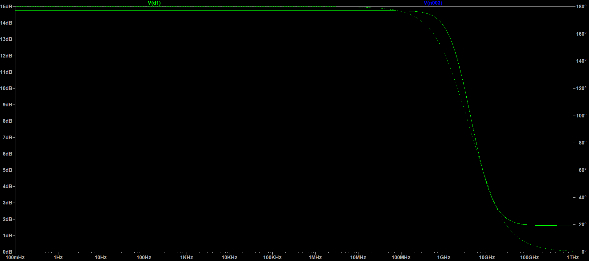
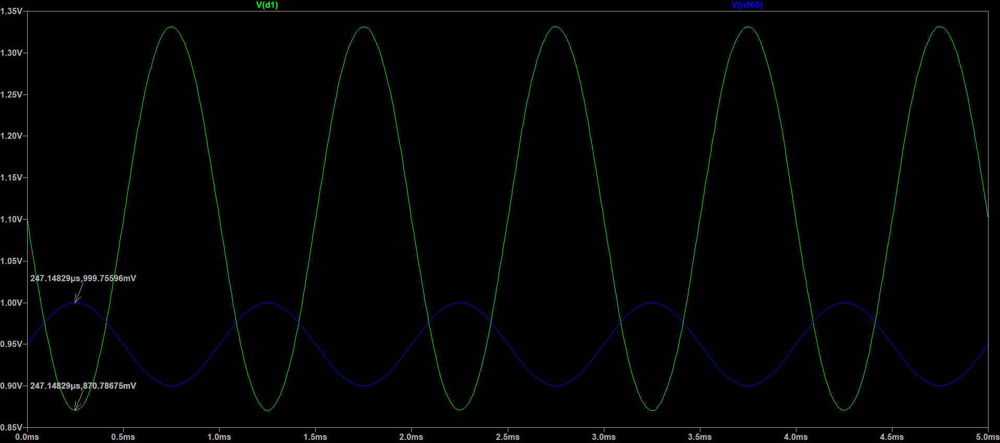
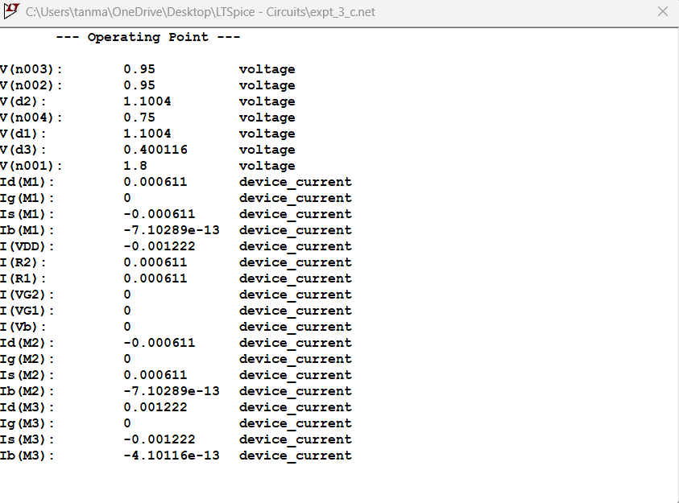

**Differential Amplifier**

**Introduction**

The MOS differential pair is a type of amplifier configuration, which
consists of two perfectly matched MOSFETs, with identical source
resistances, and matching or common inputs. The output voltage will be
the difference between the two drain source voltages (VD) of
the MOSFETs.

While we can construct the differential pair using BJTs as well, for
this experiment, we will focus on using MOSFETs. The basic building for
any op-amp is the differential amplifier, or diff-amp. Therefore,
understanding this circuit is crucial to any further understanding of
the op-amp.

This is the basic configuration of the diff-amp, with common-mode input
voltage VCM, and identically matched transistors,
Q1, Q2. From the figure, we can see the current
flowing through each transistor is half the value of the current source,
I, i.e., **ID1 = ID2 = I/2**.

The reason for the current source being present, is to allow for a
steady, constant current, ensuring the transistors are operating in
saturation, at an ideal operating point, to ensure amplification. It
also ensures identical current flows through both the MOSFETs, which is
crucial, since we need them to be perfectly matched. We will simulate
this circuit later, but first, instead of a current source, we will use
a resistor RSS, and perform DC, transient and AC analysis.

**Analysis**

Design and analyse the differential amplifier for the following
specifications:

**VDD = 1.8 V, P ≤ 2.2 mW, ViCM = 0.95 V,
VOCM = 1.1 V, Vp = 0.4 V.**

Perform DC analysis, transient analysis, frequency response, extract
parameters.

This is the circuit we will have to design, and calculate the values of
RSS, RD1, RD2.

Given: **VDD = 1.8 V, P ≤ 2.2 mW, ViCM = 0.95 V,
VOCM = 1.1 V, Vp = 0.4 V.**

P = 2.2 mW = VDD x ISS = 1.8 x ISS

ISS = 2.2 mW / 1.8 V = **1.222 mA** **- (1)**

ID1 = ID2 = ISS/2 = **0.611 mA – (2)**

RD = (VDD - VOCM)/ID1 = (1.8
– 1.1) V / (0.611 x 10-3) A = 1145.6628 Ω = **1.145 kΩ -
(3)**

RSS = Vp / ISS = 0.4 V / 1.222 mA =
327.332 Ω = **327 Ω - (4)**

From our analysis, we have now calculated the values –

RD1 = R D2 = **1.145 kΩ**

RSS = **327 Ω**

**Components Required**

DC voltage supply, AC voltage supply, N-channel MOSFETs, resistors

Parameters of MOSFET: W =

**Fig 1. Diff-amp circuit with calculated RD, RSS
values**

**DC Analysis**

Since we know the VDS, VGS values, we can
calculate whether the MOSFETs are operating in saturation or not. This
is crucial, because if the MOSFETs begin to operate in triode, the
output gets clipped, which is not what we need.

The condition for saturation is that VDS \< VOV,
i.e., VDS \< VGS - Vth, where
Vth is the threshold voltage of the MOSFET, which is obtained
from the TSMC 180 nm process technology .lib file. This can be included
in the simulation, by adding the SPICE directive, **.lib tsmc018.lib.**

We can calculate if the MOSFET is operating in saturation, by using the
relation VGD \< Vth, which is the simplification
of the saturation region condition.

VGD = (0.95 – 1.1) V = -0.15 V

Vth = 0.3966 V

For the MOSFETs, we have used **W = 108.5 µm, L = 180 nm**.

From this, we can see VGD is negative, while Vth
is greater than zero, satisfying our condition for saturation.
Therefore, we can safely say the MOSFET is in saturation, and can act as
an amplifier.

While we have determined that the MOSFET is in saturation, we need to an
ensure an ideal Q-point, to make sure that the waveform does not appear
distorted or get clipped off.

For the diff-amp circuit, since the transistors, RD,
RSS, supply voltage VDD, will be perfectly
matched, any analysis on one half of the diff-amp, can be said to be
equal to the analysis on the other. This is also known as the
**differential half circuit**, and makes analysis easier.

**Fig 2. Diff-amp circuit with calculated RD, RSS
values**

This figure is the results from our DC operating point analysis. As we
can see that VD1 = VD2 = 1.10023 V, which is
matching with our necessary requirements. ID1 =
ID2 = 0.611154 mA, ISS = 1.22231 mA which also
matches with our requirements. Vp = 0.400098 V, which also
agrees with our analysis.

Next, we can calculate the power and verify whether or not we are within
our power budget.

P = VDD. Iss = 1.8 V x 1.22231 mA = **2.200158
mW**, which satisfies our power budget.

**Fig 3. Voltage transfer characteristic (VTC) with Q-point marked**

The figure above shows the plot of VG vs VD, i.e.,
input voltage vs output voltage. We can see that the operating point is
roughly in the middle of the saturation region, which will give us an
ideal gain, and the resulting output will neither be distorted nor
clipped off.

**Fig 4. Drain characteristics for diff-amp circuit**

**Fig 5. Transfer characteristics for diff-amp circuit**

**Transient Analysis**

To perform transient analysis, we will supply an input ac sinusoidal
signal, of Vpeak = 50 mV, frequency = 1 kHz, DC offset = 0.95
V. Since we know that the differential amplifier rejects common mode
signals, we need to give an ac input to only one of the signals, while
keeping the other ac input equal to 0. This will give us an ideal gain,
while giving ac input to both MOSFETs will give us very little gain, if
any gain at all.

To perform this analysis, we need to configure the voltage source
V2, for the MOSFET M1, by setting a **sine wave**,
with DC offset = 0.95 V (Q-point VGS voltage), Amplitude = 50
mV, Frequency = 1 kHz.

For transient analysis, set the stop time equal to 5 ms, and then
compare the output and input voltages.

**Fig 6. Transient analysis for diff-amp circuit, with stop time = 5
ms**

From this figure, we can see that there is a 180° phase shift, which is
why the output, VD1 represented by the **green curve**, is
inverted compared to the input, VGS, which is represented by
the **blue curve**.

Now, we can calculate the V/V gain, and use it to calculate the dB gain,
and verify it with AC small signal analysis.

Av = Vout/Vin = (1.1 – 0.825) / (50 x
10-3) = 0.275 / (50 x 10-3) = **5.5 V/V**

**∴ Av = 5.5 V/V**

Calculating the dB gain, by using the formula, A’v =
20log10(Av), we get,

A’v = 20log10(5.5) = **14.807 dB**

**AC Analysis**

Next, we can perform AC analysis and calculate the midband gain, as well
as the 3 dB bandwidth for the differential amplifier circuit.

To perform the AC analysis, once again supply ac signal to only of the
differential amplifiers, keeping the other ac input equal to 0. Set AC
amplitude equal to 1 V, and run the simulation.

**Fig 7. AC analysis for diff-amp circuit, with AC amplitude = 1 V**

From here we can see that the midband gain is **14.756 dB**, with a
phase shift of **176.842°**, which matches approximately with our
calculated value of the midband gain.

From the figure, our 3 dB bandwidth is around **2.7 GHz**.

Next, we move onto another variation of the differential amplifier. The
only change we will be making is using a current source instead of the
RSS resistor, at the bottom of the circuit. There are quite a
few advantages of this configuration, such as increasing the common mode
rejection ratio, making the amplifier more immune to noise and
fluctuations.

Another advantage is that the current source provides a constant current
tail current, preventing variations in transistor operating points due
to fluctuations in power supply, or temperature change, maintaining the
stability of the circuit.

To build this circuit, we will use a current source of value
ID1 + ID2 = I = 1.222 mA. We can then perform DC,
AC, transient analysis, observe our readings and compare it to the
circuit with RSS.

Since we have already completed our analysis and calculated RD values,
we need not do it again, instead we can check if the output voltages are
the same, and vary any parameters accordingly.

**DC Analysis**

**Fig 8. Differential amplifier, with current source ISS**

**Fig 9. DC operating point analysis of Fig.8**

From here we can see that **VD1 = VD2 = 1.1004 V,
Vp = 0.400116 V, ID1 = ID2 = 0.611 mA,
ISS = 1.222 mA**, which are closely matching with the values
from our analysis.

From our previous analysis, we have verified that our MOSFETs are
operating in saturation, and are at a Q-point which will provide us
ideal amplification.

Next, we can calculate the power and verify that it falls within our
required budget, i.e., 2.2 mW.

P = VDD.ISS = 1.8 V x 1.222 mA = **2.1996 mW** ≈
2.2 mW.

Therefore, this configuration also fits our required power budget.

**Fig 10. Voltage Transfer Characteristic (VTC) (VG vs
VD) with operating point marked**

**Fig 11. Transfer Characteristic (VG vs ID)**

**Transient Analysis**

Next, we can perform transient analysis in the same way that we did for
the first circuit. Apply a sinusoidal signal with DC offset =
VG = 0.95 V, Amplitude = 50 mV, Frequency = 1 kHz. In
transient analysis, set stop time to 5 ms. Place the **.tran 5m**
directive anywhere on the schematic and run the simulation. Remember to
supply ac signal to only one MOSFET (in this case M1), as the
differential amplifier rejects common mode signals, as a result of which
we will get very little gain.

**Fig 12. Transient analysis, with stop time = 5 ms**

From this figure, we can see that the output curve (green) is inverted
compared to the input curve (blue), which indicates a 180° phase shift,
in accordance with our understanding of the MOSFET.

We can now attempt to calculate V/V gain, dB gain and then compare it to
the result we will obtain from the AC analysis later.

Av = Vout/Vin = (1.1 – 0.87078)/ (50
mV) = 0.22922 / 50 mV = **4.5844 V/V**

A’v = 20log10(Av) =
20log10(4.5844) = **13.2256 dB**

Now, let us perform AC analysis and see if it matches our calculations.

We can see in comparison to the RSS configuration which had a
dB gain of around 14.7 dB, and a V/V gain of 5.5 V/V, the ISS
configuration has a slightly V/V gain and dB gain.

**AC Analysis**

For the DC supply for M1, set the AC amplitude for small
signal analysis equal to 1 V, keeping the other MOSFET as ac ground. Set
the type of sweep as decade, number of points per decade to 20, start
frequency 0.1 Hz, end frequency as 1 THz.

**Fig 13. AC analysis for Fig. 8**

We can see that the midband gain is around **13.52143 dB**, which only
slight varies with the dB gain that was calculated, i.e., 13.2256 dB. If
we convert this value to V/V, we get **4.743 V/V**. We can also see that
the 3 dB bandwidth is around **2.16 GHz**, providing quite a large
frequency range for operation.

Now, we will move to the final circuit, where we will replace the
current source I1, with a NMOS. The reason we do this, is due
to the fact that the NMOS can behave as a constant current source when
operating in the saturation region, so it can act as a constant current
source, when the input gate voltage VG is applied to drive
the MOSFET into saturation.

After some trial and error, we obtain I = 1.222 mA, ID1 =
ID2 = 0.611 mA for the NMOS M3, whose **W = 125
µm, L = 180 nm**.

**DC Analysis**

**Fig 14. Differential amplifier circuit, with NMOS M3 acting
as current source**

From the figure, we can see that the VG for the M3
is **0.5725 V**, which will give us I of 1.222 mA, VD3 of
around **0.414 V**, which is not exactly the Vp we need but
is close.

**Fig 15. DC operating point
analysis for Fig. 14**

Next, we need to calculate power, to make sure that the power is within
2.2 mW, to satisfy our power budget.

P = VDD.ISS = 1.8 V x 1.22226 mA = **2.200068 mW**
*≈* 2.2 mW

Therefore, this fits our power budget, and we can proceed further. Next,
we can perform transient analysis, by applying ac input to any one of
the MOSFETs, and then calculating V/V gain, dB gain.

**Transient Analysis**

Apply a sinusoidal signal with DC offset = VG = 0.95 V,
Amplitude = 50 mV, Frequency = 1 kHz. In transient analysis, set stop
time to 5 ms. Place the **.tran 5m** directive anywhere on the schematic
and run the simulation.

**Fig 16. Transient analysis for Fig. 14, with stop time = 5 ms**

We can calculate the V/V gain by dividing
Vout/Vin. Also, the output voltage curve (green)
appears inverted compared to the input voltage curve (blue) due to a
180° phase shift.

Av = Vout/Vin = 0.285/50 mV = **5.7
V/V**

Converting this to dB, we get A’v =
20log10(Av) = 20log10(5.7) = **15.117
dB**

Now, let us perform AC analysis and then verify our calculated results.

**AC Analysis**

For the DC supply for M1, set the AC amplitude for small
signal analysis equal to 1 V, keeping the other MOSFET as ac ground. Set
the type of sweep as decade, number of points per decade to 20, start
frequency 0.1 Hz, end frequency as 1 THz.

**Fig 17. AC analysis for Fig. 14, with AC amplitude = 1V**

As we can see, we get a midband gain of around **15.4 dB**, which is
close to the calculated value. We can also the 3 dB bandwidth at around
**2.142 GHz**. From the figure, we can see that the curve is not the
standard frequency response we are used to seeing. This may be due to
the effects of the NMOS behaving as a current source, which could
explain why a current source is used since it provides stability, and
prevents noise and fluctuation.

**Inference**

After performing this experiment, we learnt how the differential
amplifier operates, and how to build it in LTSpice. We see how the
differential amplifier rejects common mode signals, but amplifies
differential mode signals, making it the ideal building block for the
operational amplifier or the op-amp.

We also observed the three different configurations for the differential
amplifier, i.e., with resistance RSS, current source
ISS, the NMOS biased as a current source operating in
saturation region.

The highest gain we observed was in the NMOS configuration, which
provided a dB gain of **15.4 dB**, compared to the other two
configurations. However, the frequency response for this configuration
seems very unstable, with constant fluctuations before the midband
(possibly due to the effects of the NMOS).

The advantage of the current source configuration is that we obtained
almost exact parameters that we had calculated for. It also provides a
more stable current ISS, since there won’t be any
fluctuations due to temperature, or any other reason. Lastly the
RSS configuration also seems reliable, but with increase in
temperature and tolerance errors, we may not get exact value of
resistance we calculated, which may decrease or increase our current
values, causing issue in power budget.

Overall, the differential amplifier is a very useful configuration,
since it measures the difference between the two drain voltages, thereby
preventing the effects of any noise. Another point to note is that the
differential amplifiers require two exactly matched N-channel MOSFETs,
making it easier to implement the circuit in LTSpice, using the **180 nm
TSMC .lib technology file.**
