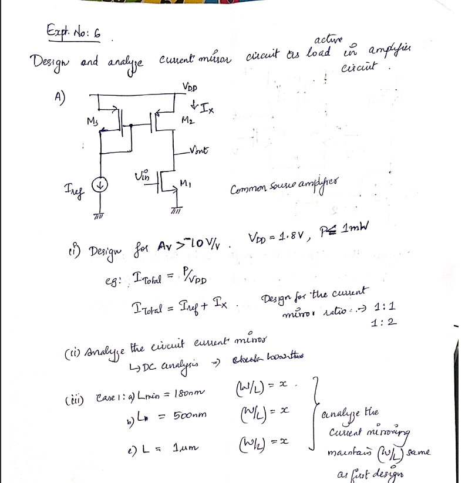

**Current Mirror**

**Part 1: Current Mirror as an Active Load**

The current mirror circuit is one of the widely used designs in IC
design to provide a stable biasing current for multiple transistors at
once. Ideally, we would bias each transistor using a current source, to
ensure stability, but since this is not feasible, we use the current
mirror design and set the corresponding (W/L) ratio of each transistor
according to how much ID we need to flow in that transistor.

As we can see, using a single IRef, we can bias the
transistor MRef, using which we can set the current flowing
through M1, making it act as an active load, and use it to as
our ID value in further transistors.

**Design Question:**

**Design: -**

From the question, we can see Itotal = P/VDD = 1
mW /1.8 V = **0.555 mA**

Next, we know that Itotal = Iref + IX, where
IX = ID. Since the (W/L) ratio specified to us is
1:1, IX + Iref = (Itotal/2) = 0.2777
mA. In the next question, where (W/L) ratio is 1:2, the value of
IX = (Itotal/3).

Next, we need to calculate how much input voltage we will need to give
the N-channel MOSFET, for it to work as an amplifier (with gain ≥ 10
V/V).

We know that AV = -gmRout =
-gm(ro1\|\|ro2), where ro1,
ro2 are the dynamic output resistances of the NMOS, PMOS
respectively, due to channel length modulation.

Since we know that ro1 = 1/λ1ID1,
ro2 = 1/λ2ID2, where ID1 =
ID2 = ID.

ro1 \|\| ro2 = 1/ID (λ1 +
λ2) = 1/ (0.277 x 10-3 x (1.382 + 1.329)) =
1331.65 Ω = **1.331 kΩ**

Note that values for λ1, λ2 have been obtained
from the TSMC 180 nm process technology .lib file, where the parameter
for these values is **PCLM (Channel Length Modulation Parameter).**

We can also write gm as 2ID/VOV.
Finally, substituting all of this back into our original equation, we
get,

AV = (2ID/VOV). Rout, from
which we can calculate **VOV as 0.0737V.**

VGS = VOV + Vt = 0.0737 + 0.496 =
**0.569V**

Therefore, our input voltage for the NMOS is 0.569 V.

**Circuit Diagram: -**

**For the P-channel MOSFETs, M1, M2: -** **W = 10 µm, L = 180 nm**

**For the N-channel MOSFETs, M3: -** **W = 31.23 µm, L = 180 nm**

**i. Using L = 180 nm**

1.  **DC Analysis**

From here, we can see that the simulation is closely matching with our
calculated values, since the current flowing through the NMOS (M3), PMOS
(M1, M2) are nearly identical. From this, we can verify whether the
circuit is following our power requirements, which is a key part in the
design of any IC or chip.

P = Itotal \* VDD = 0.55401 mA \* 1.8 V = **0.9972
mW**, which is within our power budget.

Next, we move on to transient analysis, where we can verify whether our
V/V gain requirement is satisfied or not. To do this, we will configure
our input voltage, Vin and convert it into a sinusoidal input
with DC offset of 0.569V.

2.  **Transient Analysis**

From here, we can see that
the peak output voltage is 1.2381 V, for an input peak voltage of 10 mV.
Now, we can calculate our gain, and verify our whether our gain
requirement is satisfied or not.

AV = Vout/Vin = (0.96 – 1.2381)/(10 mV)
= **-27.81 V/V = 28.884 dB**

This definitely satisfies our gain requirement, since we needed a V/V
gain of ≥ 10 V/V.

3.  **AC Analysis**

Finally, we move on to AC
analysis, where we can calculate the 3 dB bandwidth and verify our
calculated dB gain.

> From here, we can see our 3 dB BW = 629.997 MHz – 0 = **629.997 MHz**
>
> The midband gain we are obtaining from our frequency response, i.e.,
> **29.298 dB** is also similar to the value we calculated, **28.884
> dB**.

**Circuit 2: Ratio of 1:2 using L = 180 nm**

For ratio of 1:2, then Iref = Itotal/3 = **0.183
mA**.

**Circuit Diagram –**

**DC Analysis –**

**Transient Analysis –** 

Gain (V/V) = (1.26006-0.96)/ (-10 mV) = **30.006 V/V = 29.544 dB** for
an input voltage of 10 mV peak voltage, frequency of 1 kHz, sine wave.
Let us perform the frequency response to verify this.

**AC Analysis –**

From here, we can see that our midband gain is around **29.325 dB**,
which is a close match with our calculated value of 29.544 dB, which
gives a V/V gain of around **29.25 V/V**, not that far off from our
calculated gain of 30.006 V/V.

**ii. Analysis using L = 500 nm**

1)  **1:1 using L = 500 nm**

For CMOSN (M3), **W = 65.19 µm, L = 500 nm**

For CMOSP (M1, M2), **W = 10 µm, L = 500 nm**

**DC Analysis:**

**Transient Analysis:**

**AC Analysis –**

**Gain = 37.87023 dB, 3 dB BW = 122.329 MHz**

**ii. Circuit 2: Ratio of 1:2 using L = 500 nm**

For CMOSN (M3), **W = 85.243 µm, L = 500 nm**

For CMOSP (M1), **W = 10 µm, L = 500 nm**

For CMOSP (M2), **W = 20 µm, L = 500 nm**

**DC Analysis –**

**Transient Analysis –**

Gain (V/V) = **-62.063 V/V = 35.855 dB**

**AC Analysis –**

**3 dB BW = 93.0732 MHz, Gain (dB) = 38.015 dB**

**ii. Analysis using L = 1 µm**

1.  **Ratio of 1:1**

For CMOSN (M3), **W = 93.35 µm, L = 1 µm**

For CMOSP (M1), **W = 10 µm, L = 1 µm**

For CMOSP (M2), **W = 10 µm, L = 1 µm**

**DC Analysis –**

**Transient Analysis –**

Gain (V/V) = **-60 V/V = 35.563 dB**

**AC Analysis –**

**3 dB BW = 98.90171 MHz, Gain (dB) = 35.481 dB**

**ii. Analysis using L = 1 µm**

1.  **Ratio of 1:1**

For CMOSN (M3), **W = 121.51 µm, L = 1 µm**

For CMOSP (M1), **W = 20 µm, L = 1 µm**

For CMOSP (M2), **W = 10 µm, L = 1 µm**

**DC Analysis –**

**Transient Analysis –**

**AC Analysis –**

**3 dB BW = 57.2524 MHz, Gain (dB) = 38.69341 dB**

**Table of Comparisons**

| **Parameter** | **L = 180 nm (1:1)** | **L = 180 nm (1:2)** | **L = 500 nm (1:1)** | **L = 500 nm (1:2)** | **L = 1 μm (1:1)** | **L = 1 μm (1:2)** |
|----|----|----|----|----|----|----|
| **NMOS Width** | 31.23 μm | Not specified | 65.19 μm | 85.243 μm | 93.35 μm | 121.51 μm |
| **PMOS Width (M1)** | 10 μm | 10 μm | 10 μm | 10 μm | 10 μm | 20 μm |
| **PMOS Width (M2)** | 10 μm | 20 μm | 10 μm | 20 μm | 10 μm | 10 μm |
| **Voltage Gain (V/V)** | 27.81 | 30.006 | Not directly specified | 62.063 | 60 | Not directly specified |
| **Gain (dB)** | 29.298 | 29.325 | 37.87 | 38.015 | 35.481 | 38.693 |
| **3dB Bandwidth (MHz)** | 629.997 | Not clearly specified | 122.329 | 93.073 | 98.902 | 57.252 |

**Part 2: Differential Amplifier**

Now that we have understood the basics of the current mirror, we will
move onto using it to design our differential amplifier, using the same
parameters that we designed for the differential amplifier simulation.

For the N-channel MOSFETs (CMOSN), the W/L ratios are as follows: -

**M1, W = 108.5 µm, L = 180 nm**

**M2, W = 108.5 µm, L = 180 nm**

**M3, W = 22.42 µm, L = 180 nm**

**M6, W = 10 µm, L = 180 nm**

The reason for the (W/L) ratio of M3 being more than double that of M6
is because the current flowing through M3 should be double than the
current of M6, i.e., IM3 = 1.222 mA, while IM6 =
0.611 mA.

This is also the same reason why M4, M5 have the same (W/L) ratios, so
that equal amounts of current flows through both transistors.

For the P-channel MOSFETs (CMOSP), the W/L ratios are as follows: -

**M4, W = 52 µm, L = 180 nm**

**M5, W = 52 µm, L = 180 nm**

**M6, W = 10 µm, L = 180 nm**

**DC Analysis**

As we can see, for our (W/L) ratios, the values we obtain from the DC
analysis closely match the ones we require.

**Transient Analysis**

We have supplied a differential input of 10 mV peak voltage, 1 kHz
frequency, sine wave. The input is differential, i.e., only to the gate
of M1, since the output of a differential amplifier is the difference in
drain voltages of M1, M2. Since the output is a difference, if we supply
common input, the amplifier will reject the signal and provides very
little to no gain (ideally).

Av = (1.092 – 0.95)/ (-10 mV) = **-14.2 V/V = 23.045 dB**

**Results and Inferences**

The experiment demonstrates several important characteristics of current
mirror circuits with varying channel lengths and W/L ratios:

1.  **Gain-Bandwidth Trade-off**

There is a clear inverse relationship between gain and bandwidth across
the different channel lengths. The 180 nm designs show modest gain (~29
dB) but exceptional bandwidth (\>600 MHz), while the 1 μm designs
provide much higher gain (~35-39 dB) at the expense of reduced bandwidth
(\<100 MHz).

2.  **Channel Length Effects**

Increasing the channel length from 180 nm to 500 nm and then to 1 μm
results in:

1.  Increased gain: Due to reduced channel length modulation effects (λ)
    in longer channel devices, resulting in higher output resistance.

2.  Decreased bandwidth: Due to increased parasitic capacitances
    associated with larger transistor dimensions.

3.  Larger transistor widths required: NMOS widths had to be
    significantly increased (31 μm → 121 μm) to maintain the same
    current levels.

<!-- -->

3.  **W/L Ratio Impact**

The 1:2 ratio consistently outperforms the 1:1 ratio in terms of gain
across all channel lengths:

1.  For 180 nm: Modest improvement (29.298 dB → 29.325 dB)

2.  For 500 nm: Slight improvement (37.87 dB → 38.015 dB)

3.  For 1 μm: More significant improvement (35.481 dB → 38.693 dB)

The current mirror circuit's performance can thus be tailored to
specific application needs by selecting appropriate channel lengths and
W/L ratios, with clear trade-offs between gain, bandwidth, and silicon
area (as evidenced by the increasing transistor widths required for
longer channel designs).
